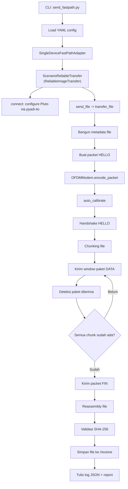
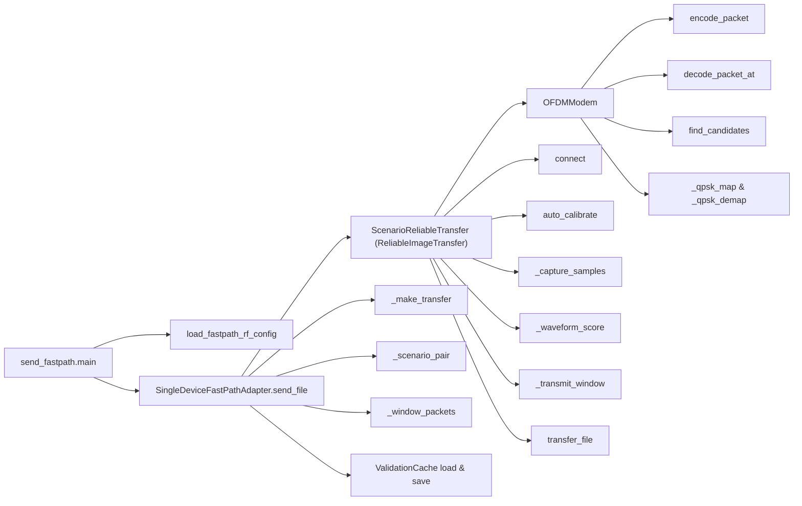
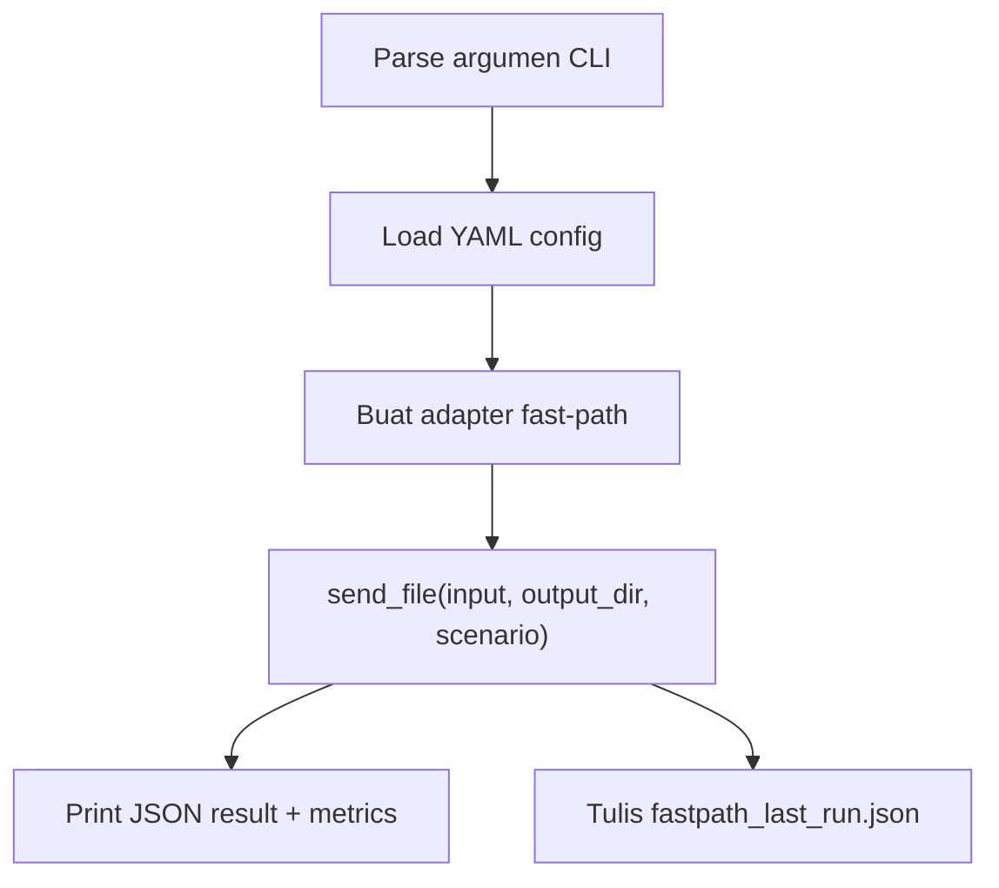
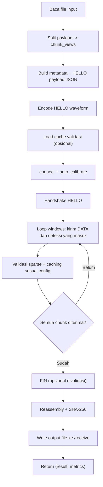
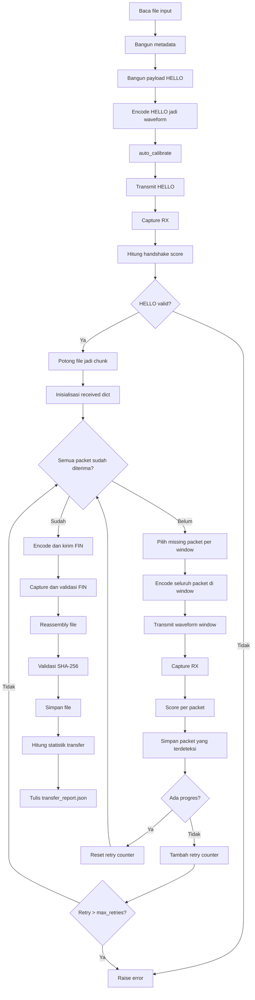
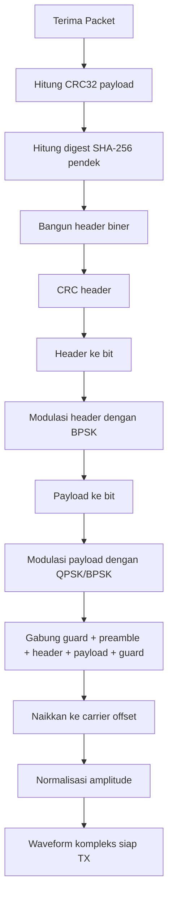
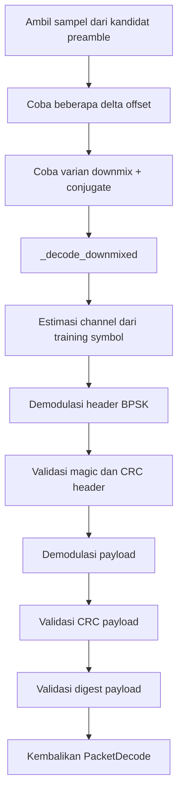
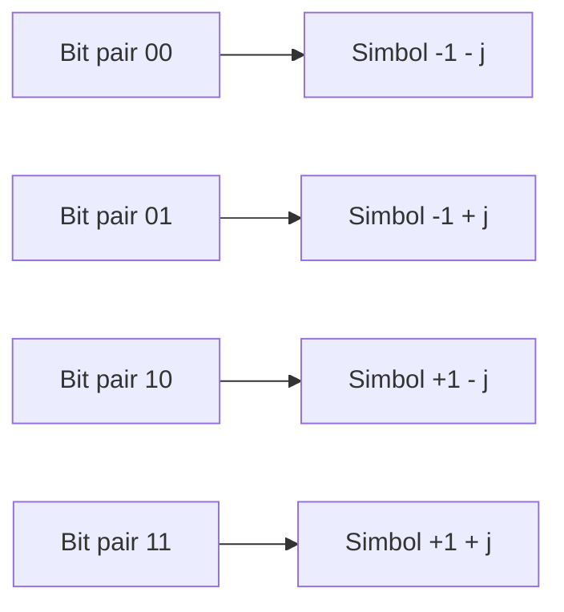
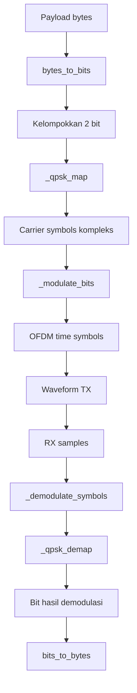
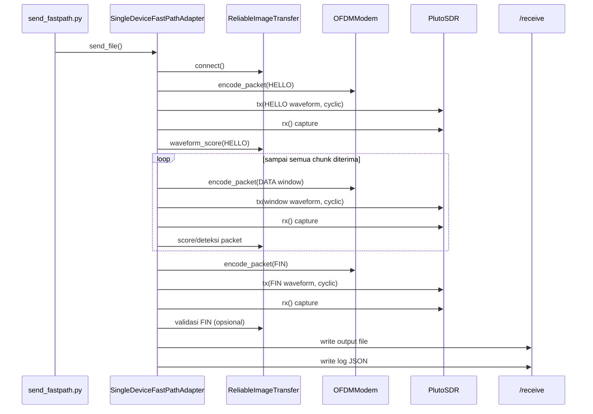

# Diagram Kerja `send_fastpath` (Fast-Path RF)

Dokumen ini menjelaskan alur kerja utama kode dari TX hingga RX menyimpan file ke `/receive`, mengikuti gaya diagram pada [DIAGRAM_KERJA.md](file:///Users/mm/GitHub/radio_fix/backup/DIAGRAM_KERJA.md).

Arsitektur yang dijelaskan terdiri dari 2 lapisan:
- Lapisan runner + adapter fast-path: [send_fastpath.py](file:///Users/mm/GitHub/radio_fix/send_fastpath.py) dan [fastpath_rf.py](file:///Users/mm/GitHub/radio_fix/optimized_transfer/fastpath_rf.py)
- Lapisan transfer RF reliabel (HELLO/DATA/FIN, reassembly, SHA-256): [backup/radio_image_transfer.py](file:///Users/mm/GitHub/radio_fix/backup/radio_image_transfer.py)

## 1. Gambaran Besar Sistem



## 2. Diagram Struktur Modul, Kelas, dan Fungsi



## 3. Alur Kerja `send_fastpath.py` (Entry Point)

Referensi: [send_fastpath.py](file:///Users/mm/GitHub/radio_fix/send_fastpath.py)



## 4. Alur Kerja `SingleDeviceFastPathAdapter.send_file()`

Referensi: [fastpath_rf.py](file:///Users/mm/GitHub/radio_fix/optimized_transfer/fastpath_rf.py)



## 5. Alur Kerja `ReliableImageTransfer.transfer_file()`

Referensi: [backup/radio_image_transfer.py](file:///Users/mm/GitHub/radio_fix/backup/radio_image_transfer.py)



## 6. Alur Kerja `OFDMModem.encode_packet()`

Referensi: [backup/radio_image_transfer.py](file:///Users/mm/GitHub/radio_fix/backup/radio_image_transfer.py)



## 7. Alur Kerja `OFDMModem.decode_packet_at()`

Referensi: [backup/radio_image_transfer.py](file:///Users/mm/GitHub/radio_fix/backup/radio_image_transfer.py)



## 8. Diagram QPSK

### 8.1 Mapping Bit ke Simbol QPSK



### 8.2 Konstelasi QPSK (bidang I/Q)

```text
                Q (imaginer)
                  ^
                  |
          01      |      11
        (-1,+1)   |    (+1,+1)
                  |
    --------------+--------------> I (real)
                  |
          00      |      10
        (-1,-1)   |    (+1,-1)
                  |
```

### 8.3 Alur QPSK di Dalam Kode



## 9. Diagram Sequence Transfer (TX → RX → Simpan File)



## 10. Ringkasan Peran Tiap Bagian

- `send_fastpath.py` mengatur CLI, membaca YAML, menjalankan adapter, dan menyimpan log JSON run terakhir.
- `SingleDeviceFastPathAdapter` mengatur batching/window adaptif, validasi sparse, dan cache validasi handshake untuk mengurangi overhead.
- `ReliableImageTransfer` mengatur koneksi SDR, handshake, retransmission, reassembly, dan statistik transfer.
- `OFDMModem` menangani framing paket, modulasi (BPSK/QPSK), demodulasi, dan validasi header/payload.
- Folder `/receive` menyimpan file hasil, log run, dan cache validasi.

## 11. File Terkait

- Runner: [send_fastpath.py](file:///Users/mm/GitHub/radio_fix/send_fastpath.py)
- Konfigurasi: [optimized_pluto_rf.yaml](file:///Users/mm/GitHub/radio_fix/configs/optimized_pluto_rf.yaml)
- Fast-path: [fastpath_rf.py](file:///Users/mm/GitHub/radio_fix/optimized_transfer/fastpath_rf.py)
- Adapter pipeline stabil: [pluto_adapter.py](file:///Users/mm/GitHub/radio_fix/optimized_transfer/pluto_adapter.py)
- Core transfer RF reliabel: [backup/radio_image_transfer.py](file:///Users/mm/GitHub/radio_fix/backup/radio_image_transfer.py)
- Artefak output: [receive/](file:///Users/mm/GitHub/radio_fix/receive)

## 12. Cara Menjalankan (Praktis)

Deteksi device:

```bash
iio_info -s
```

Kirim gambar:

```bash
PYTHONPATH=/Users/mm/GitHub/radio_fix python /Users/mm/GitHub/radio_fix/send_fastpath.py \
  --input /Users/mm/GitHub/radio_fix/input.jpg \
  --output-dir /Users/mm/GitHub/radio_fix/receive \
  --scenario loop_cable_nominal
```

Validasi manual SHA-256:

```bash
shasum -a 256 /Users/mm/GitHub/radio_fix/input.jpg
shasum -a 256 /Users/mm/GitHub/radio_fix/receive/input.jpg
```

## 13. Output dan Artefak yang Dihasilkan

- File hasil terima: default di folder [receive/](file:///Users/mm/GitHub/radio_fix/receive)
- Log JSON run terakhir: [receive/fastpath_last_run.json](file:///Users/mm/GitHub/radio_fix/receive/fastpath_last_run.json)
- Cache validasi handshake: [receive/fastpath_validation_cache.json](file:///Users/mm/GitHub/radio_fix/receive/fastpath_validation_cache.json)
