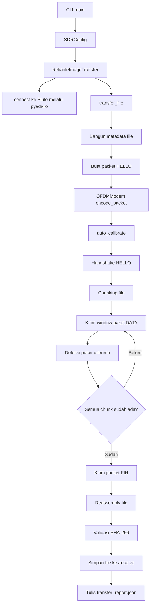
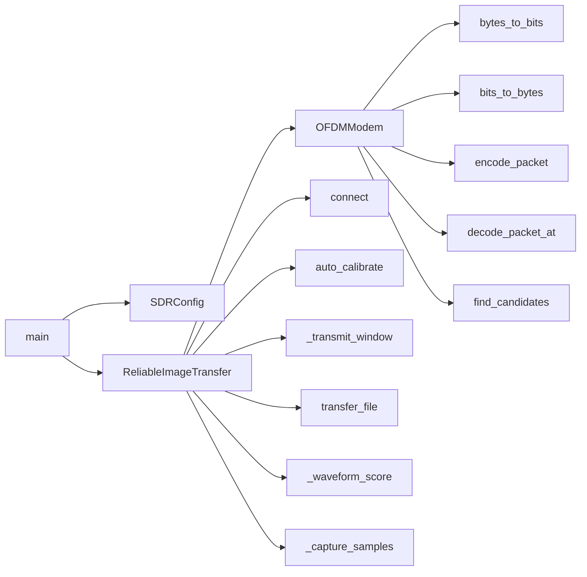
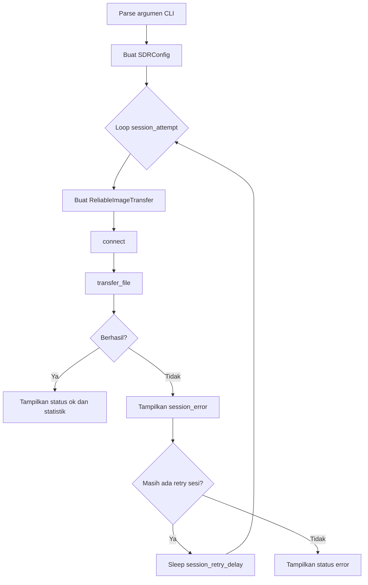
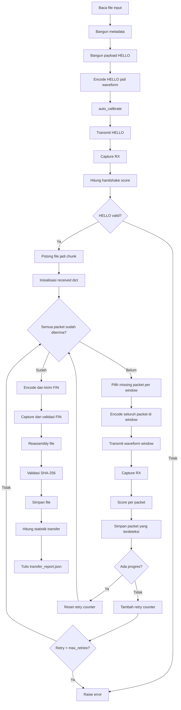
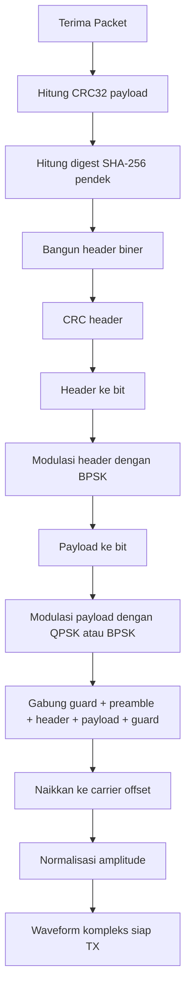
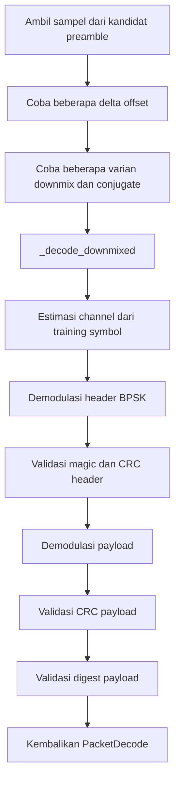
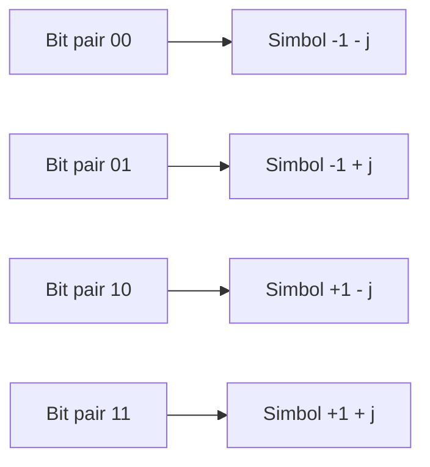
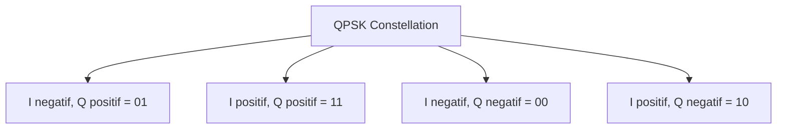
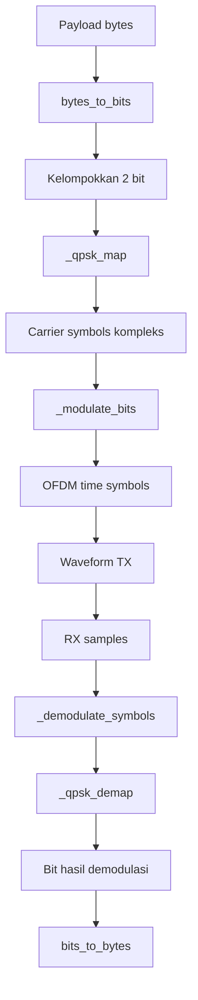
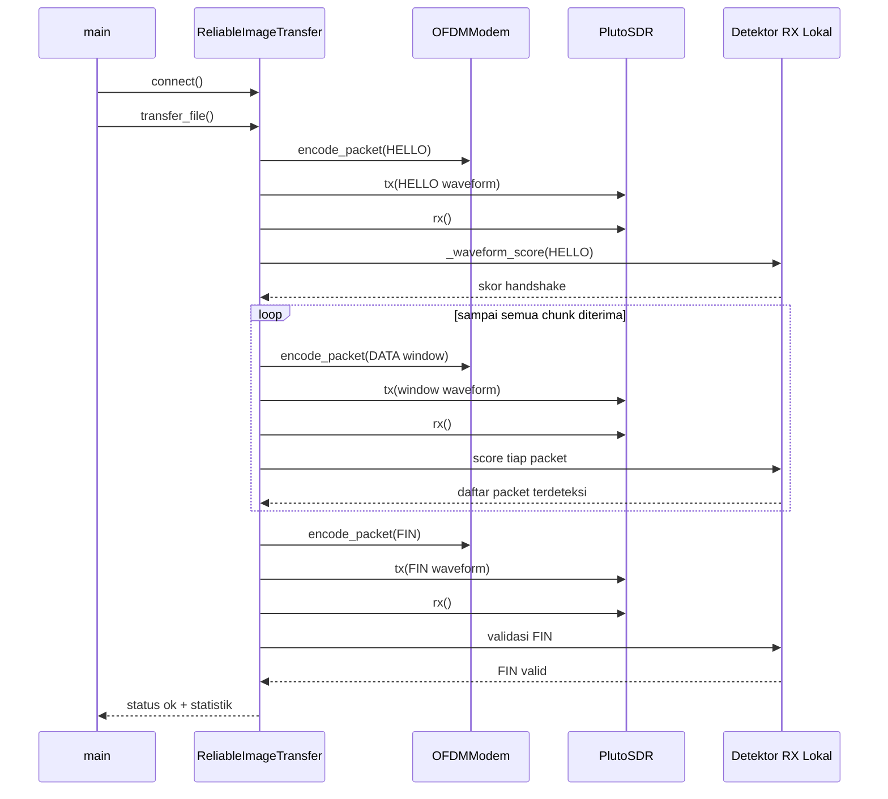

# Diagram Kerja `radio_image_transfer.py`

Dokumen ini menjelaskan alur kerja utama kode pada [radio_image_transfer.py](file:///Users/mm/GitHub/radio_fix/radio_image_transfer.py).

## 1. Gambaran Besar Sistem



## 2. Diagram Struktur Kelas dan Fungsi



## 3. Alur Kerja `main()`



## 4. Alur Kerja `transfer_file()`



## 5. Alur Kerja `OFDMModem.encode_packet()`



## 6. Alur Kerja `OFDMModem.decode_packet_at()`



## 7. Diagram QPSK

### 7.1 Mapping Bit ke Simbol QPSK



### 7.2 Konstelasi QPSK



Representasi bidang I/Q:

```text
                Q (imaginer)
                  ^
                  |
          01      |      11
        (-1,+1)   |    (+1,+1)
                  |
    --------------+--------------> I (real)
                  |
          00      |      10
        (-1,-1)   |    (+1,-1)
                  |
```

### 7.3 Alur QPSK di Dalam Kode



### 7.4 Letak Implementasi QPSK di Kode

- Mapper QPSK: [OFDMModem._qpsk_map](file:///Users/mm/GitHub/radio_fix/radio_image_transfer.py#L153-L161)
- Demapper QPSK: [OFDMModem._qpsk_demap](file:///Users/mm/GitHub/radio_fix/radio_image_transfer.py#L163-L168)
- Pemakaian saat modulasi: [OFDMModem._modulate_bits](file:///Users/mm/GitHub/radio_fix/radio_image_transfer.py#L170-L185)
- Pemakaian saat demodulasi: [OFDMModem._demodulate_symbols](file:///Users/mm/GitHub/radio_fix/radio_image_transfer.py#L187-L209)

## 8. Diagram Sequence Transfer



## 9. Ringkasan Peran Tiap Bagian

- `main()` mengatur argumen CLI dan retry sesi penuh.
- `ReliableImageTransfer` mengatur koneksi SDR, handshake, retransmission, reassembly, dan statistik transfer.
- `OFDMModem` menangani framing paket, modulasi, dan demodulasi.
- `bytes_to_bits()` dan `bits_to_bytes()` menjadi utilitas serialisasi bit.
- `transfer_report.json` menyimpan hasil akhir transfer.

## 10. File Terkait

- Implementasi utama: [radio_image_transfer.py](file:///Users/mm/GitHub/radio_fix/radio_image_transfer.py)
- Laporan transfer terakhir: [transfer_report.json](file:///Users/mm/GitHub/radio_fix/receive/transfer_report.json)
